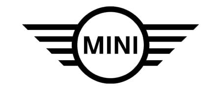

<h1 align="center">
     
</h1>

<h2 align="center">Mini Canada - Vue.js Study Case</h2>

<p align="center">
    
  
  
  
  
  
</p>

----
<h4 align="center">
  This is a study case of the <a href="https://www.mini.ca">Mini Canada</a> Website exploring Vue.Js and handling data. 
</h4>

<p align="center">
  <a href="#page_with_curl-about">About</a>&nbsp;&nbsp;&nbsp;|&nbsp;&nbsp;&nbsp;
  <a href="#hammer-technologies">Technologies</a>
  &nbsp;&nbsp;&nbsp;|&nbsp;&nbsp;&nbsp;
  <a href="#books-requirements">Requirements</a>&nbsp;&nbsp;&nbsp;|&nbsp;&nbsp;&nbsp;
  <a href="#rocket-getting-started">Getting started</a>&nbsp;&nbsp;&nbsp;|&nbsp;&nbsp;&nbsp;
  <a href="#thought_balloon-inspiration">Inspiration</a>
</p>

## :page_with_curl: About

The Mini App is a website that allow users to get to know more about the Mini Canada lineup, financing, and leasing possibilities.

The project main goal was to explore the Mini Website and how data flows in Vue.js. All the data was retrieved using the Fetch API from a MySql Database.

## :hammer: Technologies

This project was developed with the following technologies:

- HTML
- SASS
- JavaScript
- Vue.Js
- PHP
- MySql

## :books: Requirements
- To have [**Git**](https://git-scm.com/) installed to clone the repository.
- To have **MAMP/WAMP/LAMP** installed to run the project in the local server.

## :rocket: Seeing it in action
``` bash
  # Clone the repository:
  https://github.com/eduardoschlichting/schlichting_e_mini_app

  # Upload the database to the phpMyAdmin Server

  # Run the project in your local server port

  # Enjoy!
```

## :memo: License

This project is under the MIT license. 

```
MIT License

Copyright (c) 2021 Eduardo Schlichting

Permission is hereby granted, free of charge, to any person obtaining a copy
of this software and associated documentation files (the "Software"), to deal
in the Software without restriction, including without limitation the rights
to use, copy, modify, merge, publish, distribute, sublicense, and/or sell
copies of the Software, and to permit persons to whom the Software is
furnished to do so, subject to the following conditions:

The above copyright notice and this permission notice shall be included in all
copies or substantial portions of the Software.

THE SOFTWARE IS PROVIDED "AS IS", WITHOUT WARRANTY OF ANY KIND, EXPRESS OR
IMPLIED, INCLUDING BUT NOT LIMITED TO THE WARRANTIES OF MERCHANTABILITY,
FITNESS FOR A PARTICULAR PURPOSE AND NONINFRINGEMENT. IN NO EVENT SHALL THE
AUTHORS OR COPYRIGHT HOLDERS BE LIABLE FOR ANY CLAIM, DAMAGES OR OTHER
LIABILITY, WHETHER IN AN ACTION OF CONTRACT, TORT OR OTHERWISE, ARISING FROM,
OUT OF OR IN CONNECTION WITH THE SOFTWARE OR THE USE OR OTHER DEALINGS IN THE
SOFTWARE.
```

----
Made with ❤️ by Eduardo Schlichting 👋🏻 [Get in touch!](https://github.com/eduardoschlichting)


